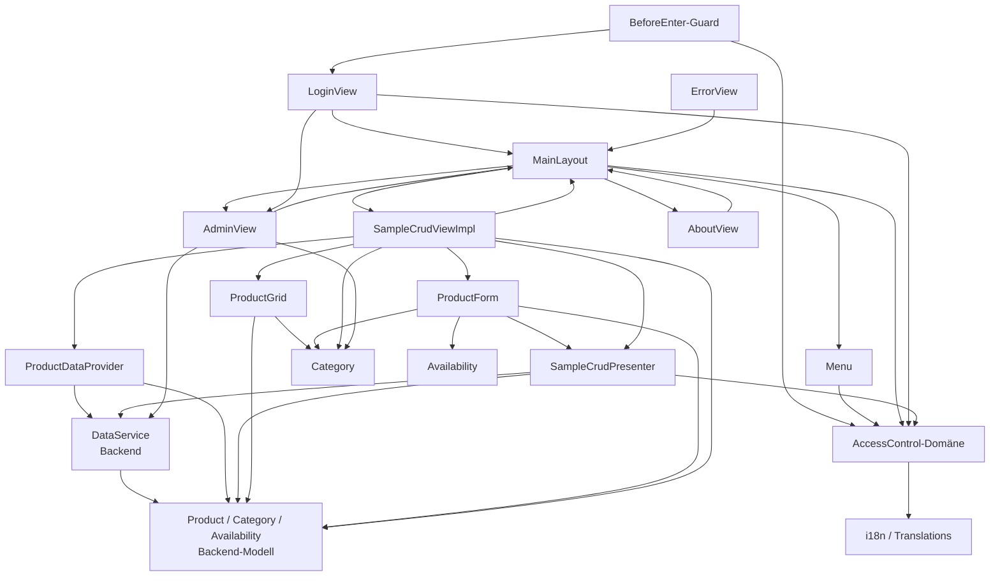

# Migration-Roadmap — Vaadin → Angular (Bookstore)

**Stand:** 2026-06-25
**Quelle:** `bookstore-starter-flow-ui/src/main/java/com/vaadin/samples/` (Vaadin 24 / Flow + Java EE)
**Ziel:** `bookstore-angular/` (Angular 22, Standalone Components, Signals, Reactive Forms, Material 22 / M3)
**Referenz:** `ui-design-plan/` (annotierte Views, Flows, Empfehlungen)

Dieses Dokument ist das Gesamtbild. Die feinkörnigen, umsetzbaren Einheiten stehen in
`migration-backlog.md` (M-IDs). Hier: Scope, Dependency-Map, hergeleitete Reihenfolge.

---

## 1. Scope

### Im Scope (UI-Migration)
Der komplette Vaadin-UI-Layer (`com.vaadin.samples`, 22 Java-Dateien). Daraus
abgeleitet 14 migrierbare Einheiten (siehe Backlog). Views, Layout, Auth-UI-Schicht,
Datenanbindung (DataProvider), i18n, Routing/Guards, Error-Handling.

### Außerhalb des Scope (bleibt unverändert)
- **`bookstore-starter-flow-backend/`** — REST-API / Domänenmodell bleibt Java EE
  (CLAUDE.md: „Backend bleibt unverändert"). Die Domänenklassen `Product`, `Category`,
  `Availability` sowie `DataService` werden auf Angular-Seite als **TypeScript-Modelle +
  HTTP-Service** *neu abgebildet*, nicht aus Java migriert. Sie sind das Fundament und
  bilden die Wurzeln der Topologie.

### Bewusst nicht migriert (mit Grund)
| Vaadin-Einheit | Grund |
|----------------|-------|
| Keyboard-Shortcuts (Ctrl+F/S/L, Alt+N, Page-Up/Down, Esc) in `SampleCrudViewImpl`, `ProductForm`, `MainLayout` | Explizites Nicht-Ziel (CLAUDE.md). Funktionalität bleibt per Maus/Touch erreichbar. |
| Finnisch als zweite Sprache (`CustomI18NProvider.LOCALE_FI`) | Demo-Vorgabe: Zweitsprache ist Deutsch statt Finnisch. |
| Cookie-/Session-basierte Locale-Wiederherstellung (`CookieUtil`, `BookstoreInitListener`, `afterNavigation`-Locale-Logik) | Infrastruktur-Detail; client-seitige Locale-Verwaltung in Angular gelöst (kein eigener Nutzer-Flow, siehe `flows/overview.md`). |
| `LoggerProducer` (CDI-Producer für SLF4J-Logger) | Reines CDI-Plumbing; Angular nutzt `console`/native Logging. Kein Migrationsartefakt. |
| `CustomSystemMessagesProvider` (Vaadin-Push/Session-Expired-Messages) | Vaadin-Server-Push-spezifisch; in Angular durch HTTP-Interceptor/Toast ersetzt. Kein 1:1-Pendant. |
| `Configuration` (`@Theme`, `@PWA`, AppShell) | Vaadin-Bootstrapping; entspricht `angular.json`/`app.config.ts`/PWA-Setup, kein eigenständiges Backlog-Item. |
| `ErrorView` als dedizierter 404-Screen | Laut Laufzeitbeobachtung (`flows/overview.md`) zeigt die App einen Toast, keinen Screen. Wird als Angular-`wildcard`-Route + Notification abgebildet (M-13), die Java-Klasse selbst nicht 1:1 übernommen. |

---

## 2. Inventar (Survey)

14 migrierbare Einheiten, gruppiert:

**Datenschicht (Angular-Neuabbildung des Backend-Contracts)**
- Domänenmodelle: `Product`, `Category`, `Availability` (enum)
- `DataService` (Backend-Zugriff)
- `ProductDataProvider` (Filter-/Cache-/CRUD-Adapter auf `DataService`)

**Querschnitt / Infrastruktur**
- i18n (`CustomI18NProvider` + `translate`-ResourceBundles)
- Auth-Domäne (`AccessControl` / `BasicAccessControl` / `CurrentUser`)
- Routing-Guard (`BookstoreBeforeEnterListener`)

**Layout / Navigation**
- `MainLayout`, `Menu`

**Views**
- `LoginView`, `SampleCrudViewImpl` (+ `SampleCrudView`-Interface, `SampleCrudPresenter`),
  `ProductGrid`, `ProductForm`, `AdminView`, `AboutView`, `ErrorView`

---

## 3. Dependency-Map (belegt)

Jede Kante ist mit `Datei:Zeile` belegt. Vaadin-Framework-Importe sind keine Kanten —
nur Abhängigkeiten zwischen migrierbaren Einheiten bzw. zum Backend-Contract.

### Belegtabelle (Auszug der tragenden Kanten)

| Von | Nach | Beleg (`Datei:Zeile`) |
|-----|------|------------------------|
| DataService | Product | `backend/.../DataService.java` (Contract; `MockDataService` liefert `Product`) |
| ProductDataProvider | DataService | `crud/ProductDataProvider.java:13,24,36` |
| ProductDataProvider | Product | `crud/ProductDataProvider.java:14,22` |
| AccessControl-Impl | CurrentUser | `authentication/BasicAccessControl.java:21` |
| BookstoreBeforeEnterListener | AccessControl | `BookstoreBeforeEnterListener.java:8,20` |
| BookstoreBeforeEnterListener | LoginView | `BookstoreBeforeEnterListener.java:9,30` |
| Menu | AccessControl | `Menu.java:19,39,78` |
| MainLayout | Menu | `MainLayout.java:38,44,55` |
| MainLayout | AccessControl | `MainLayout.java:22,44,62` |
| MainLayout | SampleCrudViewImpl | `MainLayout.java:23,50` |
| MainLayout | AboutView | `MainLayout.java:21,53` |
| MainLayout | AdminView | `MainLayout.java:67` (dynamische Registrierung) |
| LoginView | AccessControl | `LoginView.java:... (Inject)`, `LoginView.java:65,139,153` |
| LoginView | MainLayout | `LoginView.java:33,157` |
| LoginView | AdminView | `LoginView.java:30,155,156` |
| SampleCrudPresenter | DataService | `crud/SampleCrudPresenter.java:4,31,55` |
| SampleCrudPresenter | AccessControl | `crud/SampleCrudPresenter.java:3,32,44` |
| SampleCrudPresenter | Product | `crud/SampleCrudPresenter.java:5,82` |
| ProductGrid | Product | `crud/ProductGrid.java:12,25` |
| ProductGrid | Category | `crud/ProductGrid.java:11,104` |
| ProductForm | SampleCrudPresenter | `crud/ProductForm.java:77,133` |
| ProductForm | Product/Category/Availability | `crud/ProductForm.java:41,42,43` |
| SampleCrudViewImpl | SampleCrudPresenter | `crud/SampleCrudViewImpl.java:70,78,82` |
| SampleCrudViewImpl | ProductGrid | `crud/SampleCrudViewImpl.java:66,86` |
| SampleCrudViewImpl | ProductForm | `crud/SampleCrudViewImpl.java:67,91` |
| SampleCrudViewImpl | ProductDataProvider | `crud/SampleCrudViewImpl.java:74,78,87` |
| SampleCrudViewImpl | MainLayout | `crud/SampleCrudViewImpl.java:34,47` |
| AdminView | DataService | `AdminView.java:25,56,61` |
| AdminView | Category | `AdminView.java:26,53` |
| AdminView | MainLayout | `AdminView.java:39` (`@RouteScopeOwner`) |
| AboutView | MainLayout | `about/AboutView.java:11,14` |
| ErrorView | MainLayout | `ErrorView.java:20` (`@ParentLayout`) |

### Hinweise / Auffälligkeiten
- **Zyklus Login ↔ MainLayout/AdminView:** `LoginView` registriert die `AdminView`-Route
  unter `MainLayout` (`LoginView.java:155-157`), während `MainLayout` umgekehrt das
  `LoginView` nicht direkt referenziert — der Rückweg läuft über den Guard
  (`BookstoreBeforeEnterListener.java:30`). Es ist also **kein harter Klassen-Zyklus**,
  sondern eine Routing-Kopplung. **Schnittpunkt-Vorschlag:** Routing/Guard (M-06) als
  Querschnitt früh ziehen, dann ist die dynamische Admin-Registrierung in Angular nur
  noch eine Guard-/Route-Konfiguration ohne Klassen-Zyklus. HITL entscheidet.
- **`SampleCrudView`-Interface:** reines MVP-Vertragsinterface (View ↔ Presenter).
  Wird in Angular nicht als eigenes Artefakt gebraucht (Component + Service genügen),
  fließt in M-09/M-11 ein.
- **`BookstoreTitle`** wird in `about/AboutView.java:10,28` importiert/instanziiert,
  existiert aber **nicht** im Quellbaum (`grep` ohne Treffer außer dem Import). Kante
  daher **unbestätigt** — vermutlich externe Add-on-Klasse oder fehlende Datei. In M-12
  als offener Punkt vermerkt (in Angular durch einfache Titel-Komponente ersetzbar).

---

## 4. Hergeleitete Reihenfolge (topologisch)

Reihenfolge folgt der Dependency-Map: Wurzeln (keine ausgehenden Kanten auf migrierbare
Einheiten) zuerst, dann aufsteigend. Querschnitt (Test-Harness, i18n, Auth, Guard) bewusst früh.

| Phase | Einheiten | Begründung |
|-------|-----------|------------|
| **0 — Test-Harness** | E2E/Playwright-Gerüst (M-00) | Querschnitt; muss vor der ersten View stehen, damit jede Migration gegen Flows verifizierbar ist. |
| **1 — Fundament** | Modelle (M-01), DataService/HTTP (M-02), i18n (M-03) | Keine ausgehenden Kanten bzw. nur Backend-Contract. Wurzeln. |
| **2 — Domänen-Querschnitt** | Auth (M-04), ProductDataProvider (M-05), Guard/Routing (M-06) | Hängen nur an Phase 1. Auth + Guard sind Voraussetzung für jede geschützte View. |
| **3 — Shell** | MainLayout (M-07), Menu (M-08) | Hängt an Auth (M-04). Router-Layout aller Views. |
| **4 — Einfache & Daten-Views** | LoginView (M-09), AboutView (M-12), ErrorRoute (M-13), ProductGrid (M-10) | Login hängt nur an Auth+Layout; About/Error nur an Layout; Grid nur an Modellen. |
| **5 — Orchestrierende CRUD-View** | SampleCrudView + Presenter + ProductForm (M-11) | Höchster Fan-in: braucht Grid, Form, DataProvider, Presenter, Layout. Zuletzt unter den Kern-Views. |
| **6 — Admin** | AdminView (M-14) | Hängt an DataService + Layout; dynamische Route-Registrierung baut auf Guard/Routing (M-06) und Login (M-09) auf. |

Kurzform der Sequenz:
`M-00 → M-01 → M-02 → M-03 → M-04 → M-05 → M-06 → M-07 → M-08 → M-09 → M-10 → M-11 → M-12 → M-13 → M-14`

Innerhalb gleicher Phase ist die Reihenfolge frei (keine Kanten untereinander). Jede
Einheit durchläuft den vollen `/migrate`-Zyklus (Analyze → Translate → Refactor → Verify)
mit HITL-Gate. Details siehe `migration-backlog.md`.
